# [TCP/IP协议和互联网协议群](https://course.study.163.com/480000006851432/lecture-480000037172592)

##### 一、互联网协议群

> 其实所有层都在用自己的方式保证数据的可靠
>
> ps：如果不可靠，那么会把数据可靠这件事交给UDP去做

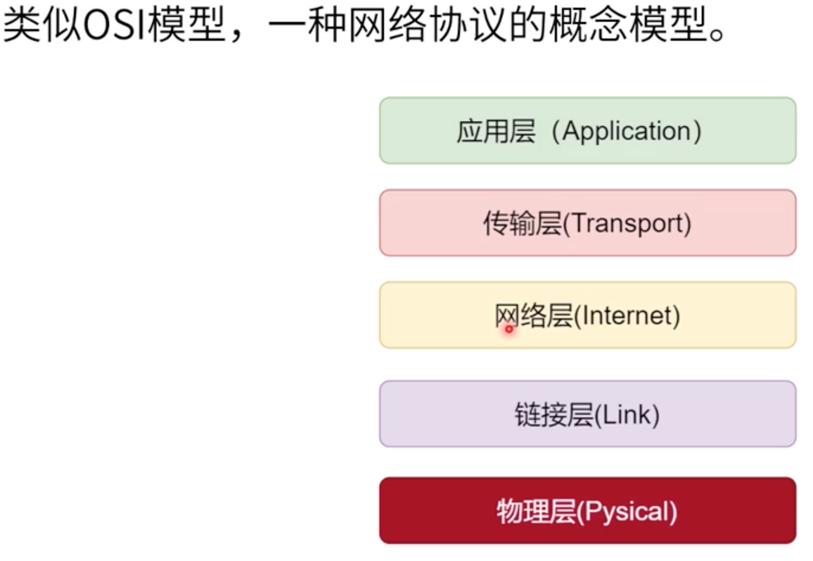

1.应用层

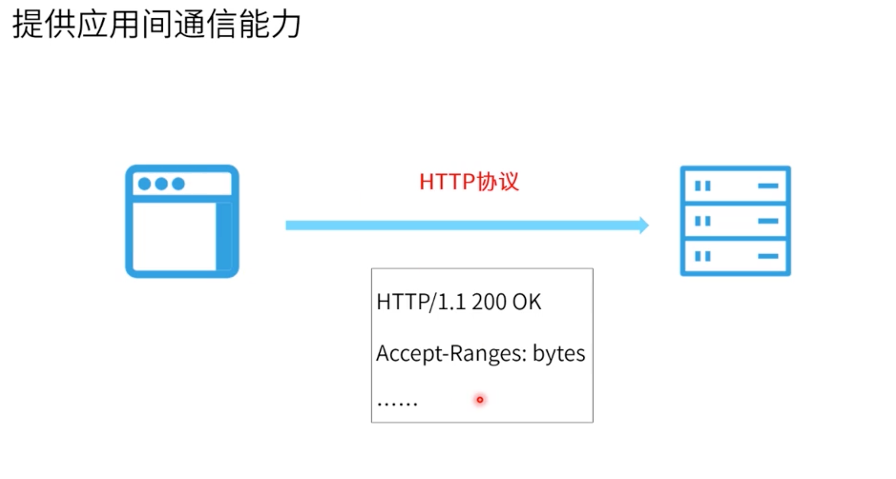

2.传输层

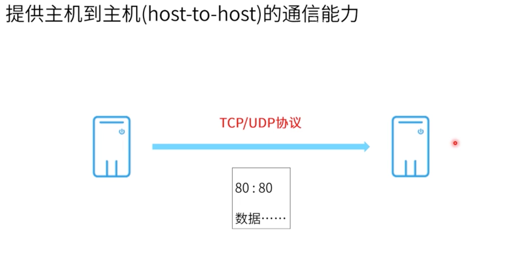

3.网络层

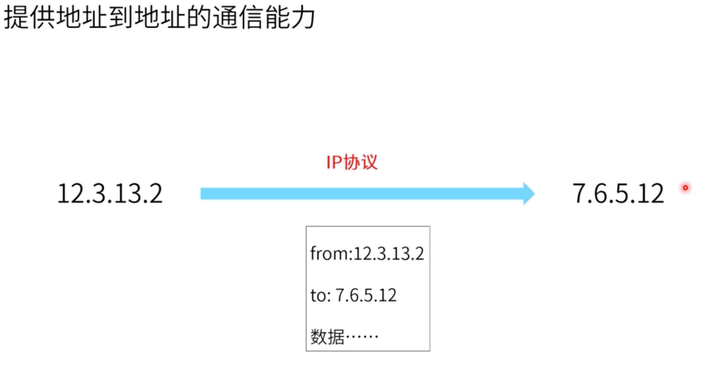

4.链路层

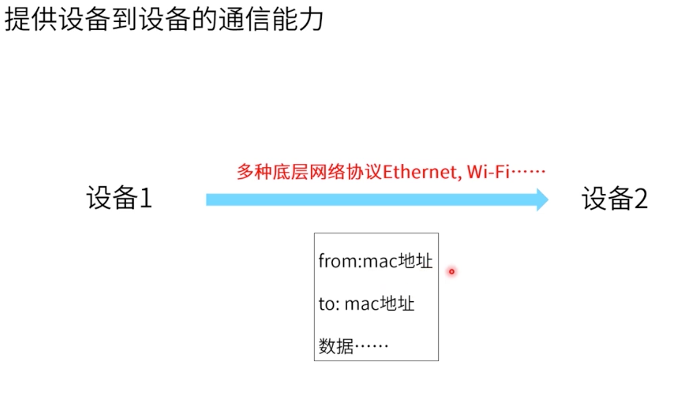

##### 二、重要标识

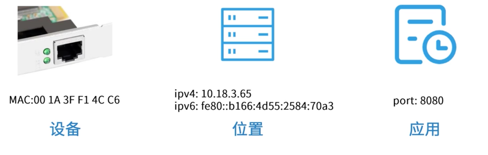

##### 三、TCP/IP封包

1.各层数据有自己的封包，每层都添加一个header头部，header用来描述传输行为，相当于说明书。

2.只有`链路层`会增加一个footer尾部，这是为了保护数据，header和footer是用来区分一块一块数据。

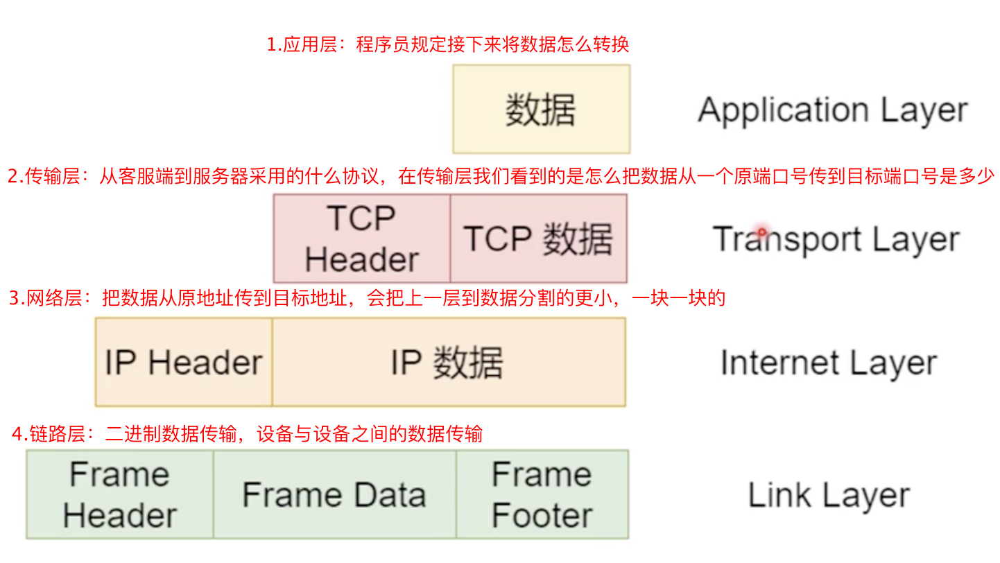

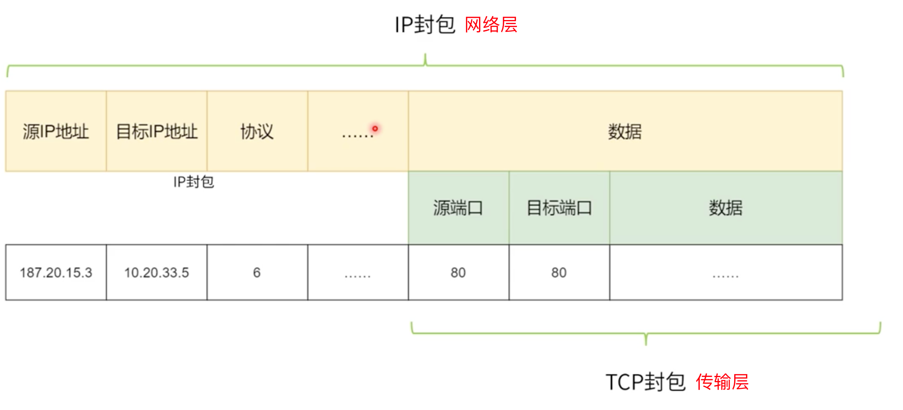

3.完整的TCP协议头(具体的项可查阅资料，这里不补充说明)

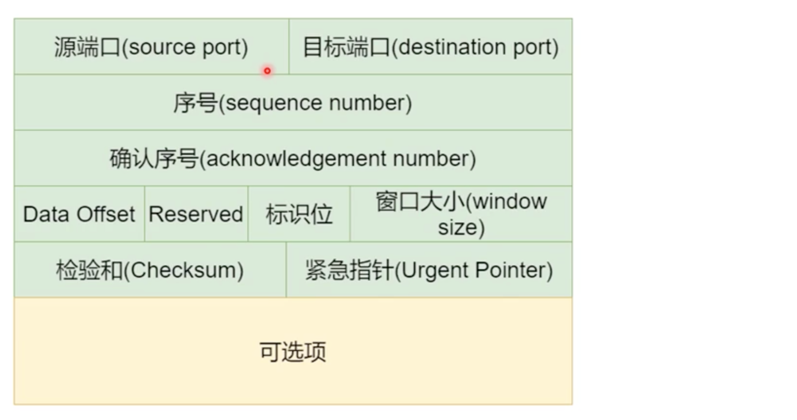

4.TCP协议封包

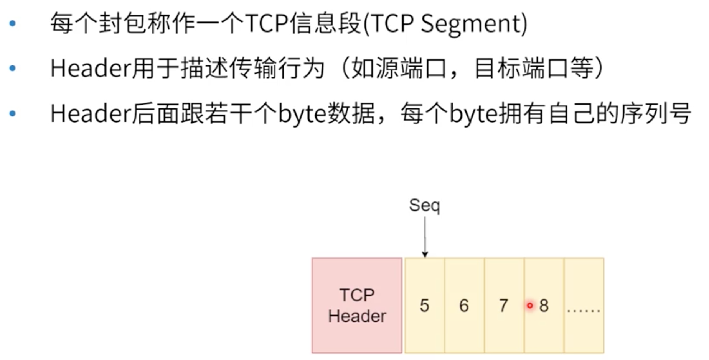

##### 四、建立连接为什么需要3次握手（TCP协议）

作用：所有层都在用自己的方式保证数据的可靠

###### 1.异常情况

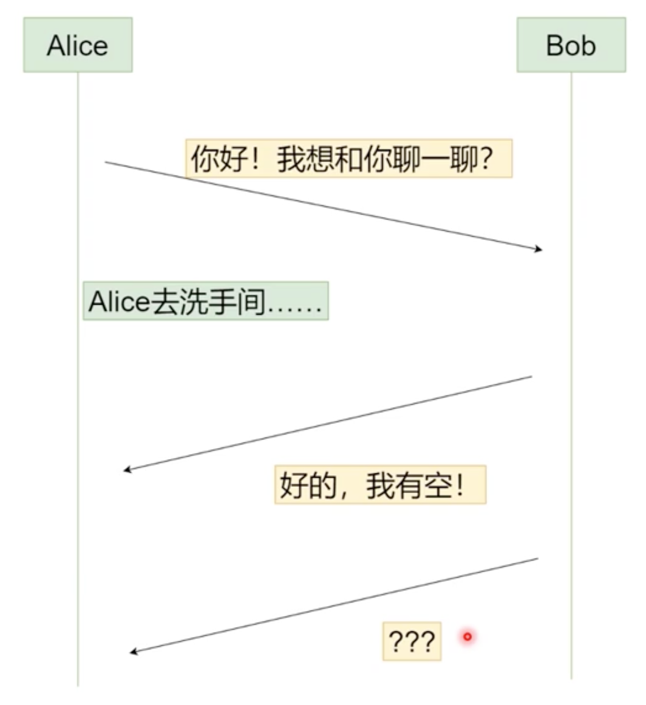

###### 2.正常情况

> *SYN*：同步序列编号（*Syn*chronize Sequence Numbers），是TCP/IP建立连接时使用的握手信号。

关于下面更多的专业名词可自行百度它的含义，方便自身理解

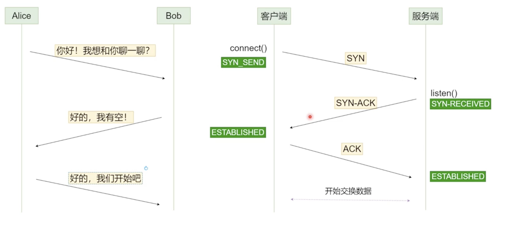

###### 3.数据顺序问题

数据传输过程中，谁先到谁后到不一定。那么我们如何区分处理？

Ps：做前端开发千万不要以浏览器的时间为准，因为每个用户在浏览器的时间不一样的

> 
>
> ​	3.1确定一个消息的顺序：绝对时间
>
> ​		不可取，因为我们的绝对时间不可得，因为每个服务器之间的时间可能也有差别
>
> ​	3.2TCP/IP协议的处理方法（不变量）
>
> ​		
>
> ​	3.3通过3.2中的不变量可以解决数据顺序问题
>
> ​		3.3.1三次握手
>
> ​		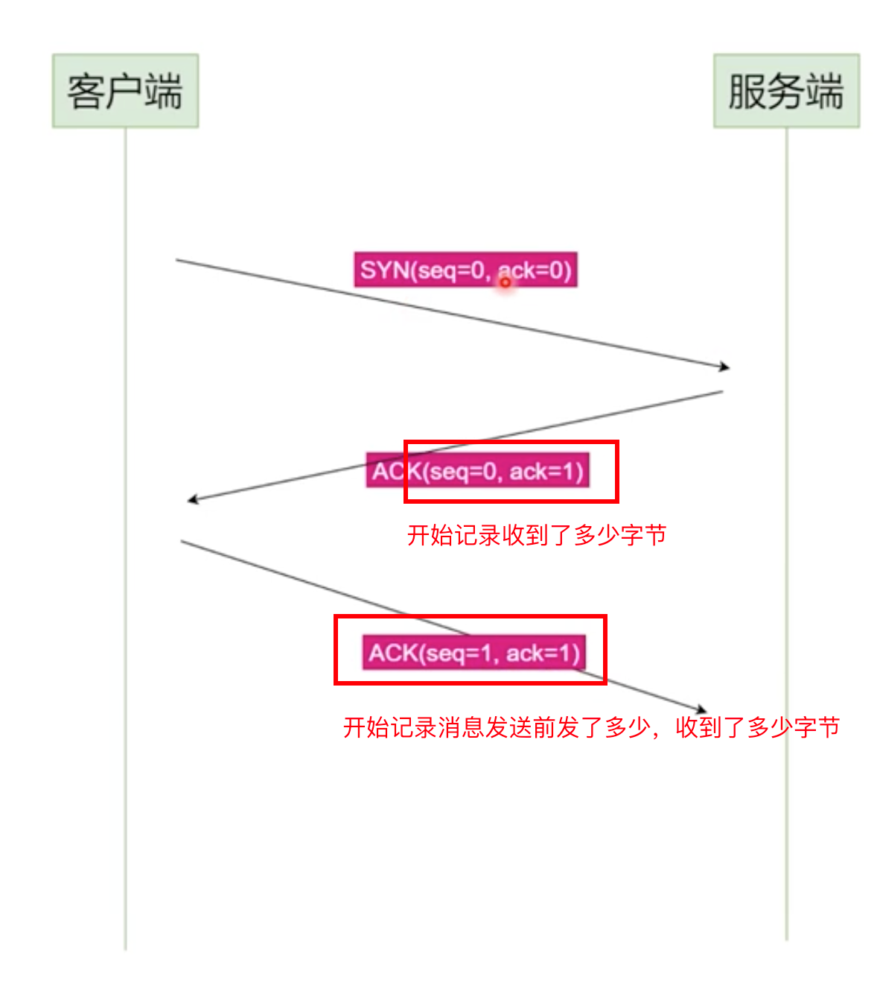
>
> ​		3.3.2数据传送（握手完了以后开始数据传送）
>
> ​				在TCP协议里必须有一个ACK返回，否则TCP会认为消息没有送达或者连接中断了。
>
> ​				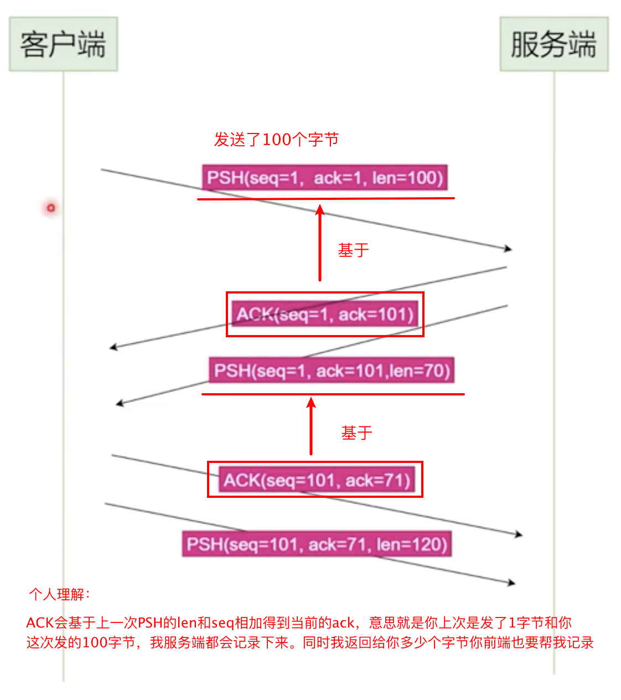
>
> ​		3.3.3顺序解决
>
> ​				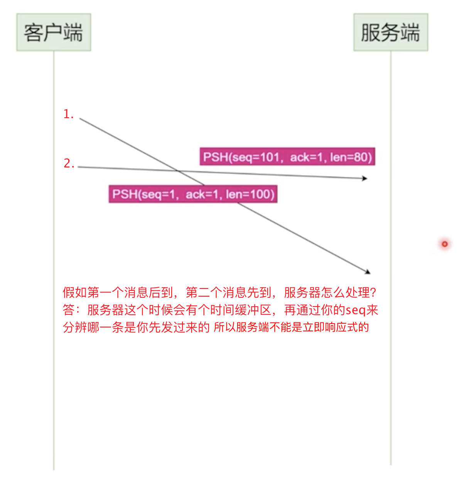
>
> ​		3.3.4TCP结束场景
>
> ​				两个人都得把话说完说清楚了才能结束，事事有回应，件件有着落。
>
> ​				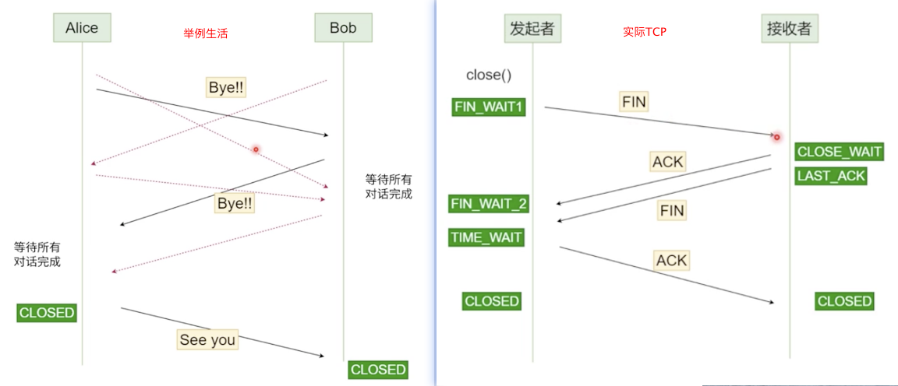
>
> 

​		

##### 五、总结

以前通过欧盟的iso标准搞了一个osi7大层：应用，展示，会话，传输，网络，数据链路，物理，后面根据这个网络协议模型概念又出了个互联网协议群：应用，传输，网络，数据链路，物理这5大层。各层都会进行封包处理再传给下一层。每层都会有个header头部协议，协议就像说明书一样。

> 1.应用层，提供应用之间的通信能力，比如用的啥协议http网络协议，ftp文件共享，smtp邮件传输，应用端口是多少。
> 		2.传输层，提供host与host之间的通信能力，比如TCP/UDP协议，http和smtp底层都是基于TCP
> 		3.网络层，提供ip与ip之间的通信能力，将数据分割成多片。比如IP协议，从本机地址到服务器地址
> 		4.数据链路层，提供设备到设备之间的通信能力，多种底层网络协议，比如wifi，网关
> 		5.物理层，这个就有点科技了，二进制转换后是通过电频传输还是(卫星)光波...