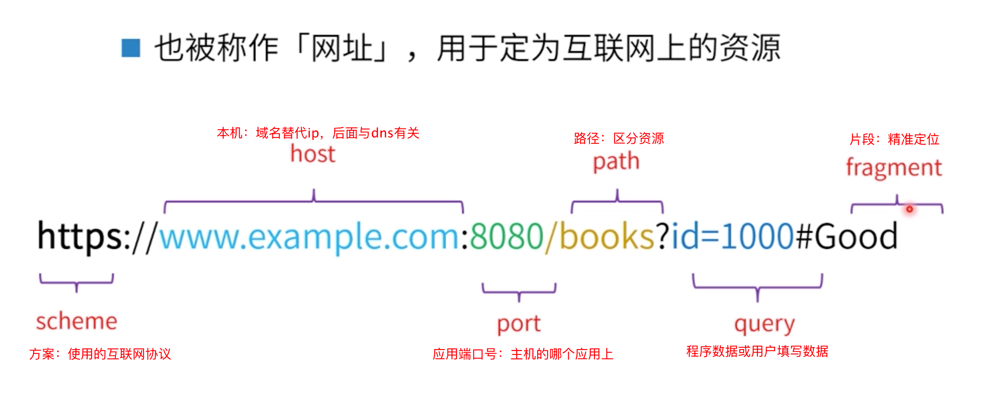
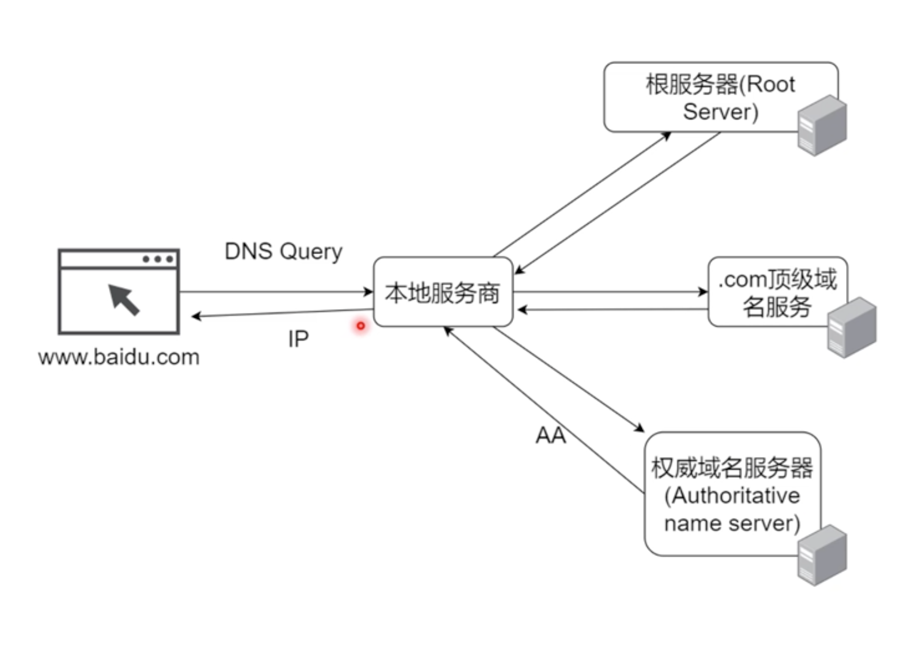
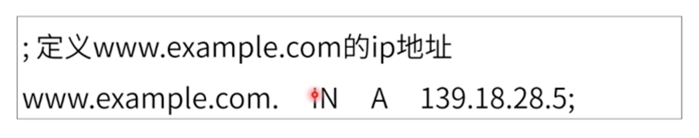
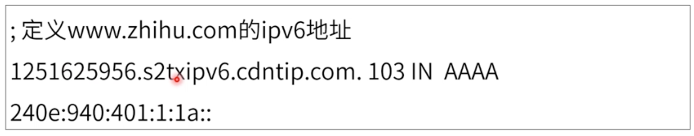
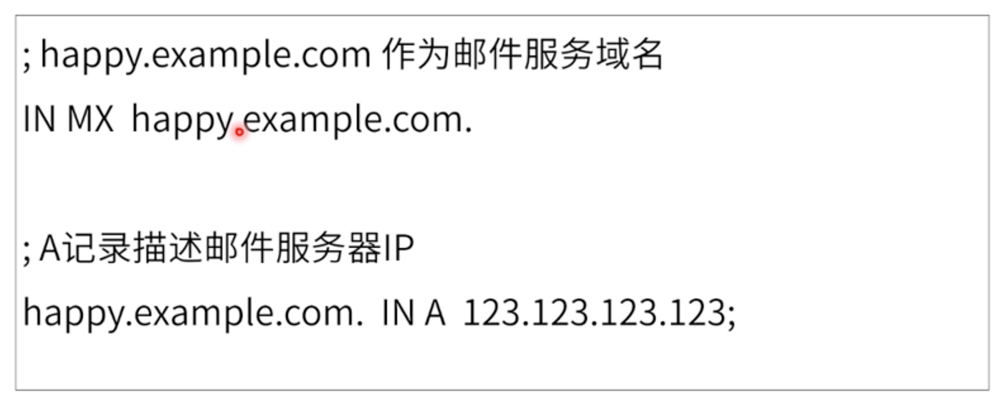
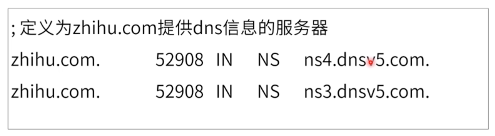
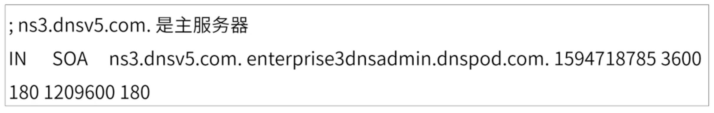
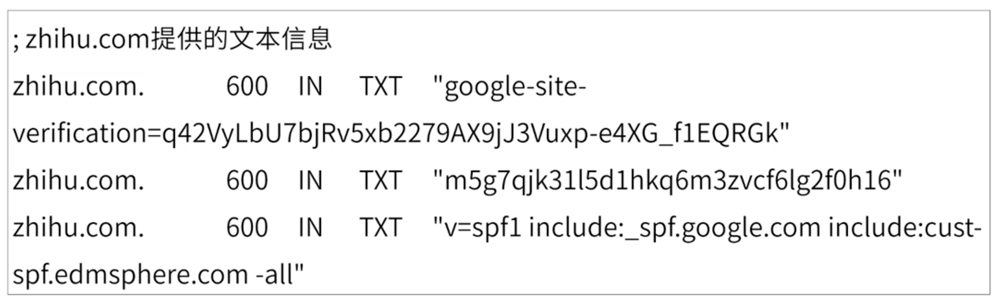
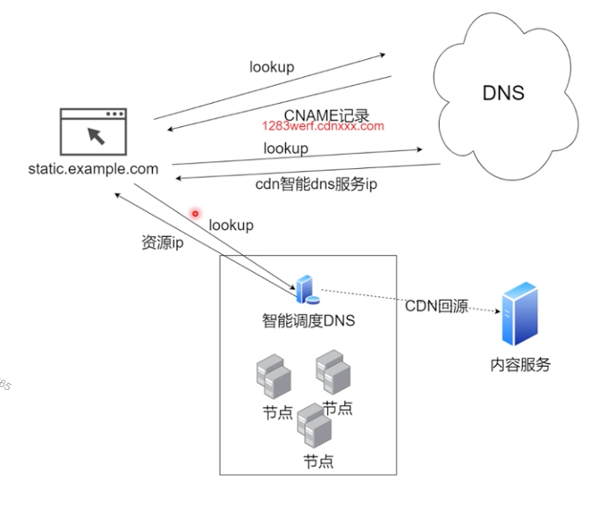

# [DNS与CDN](https://course.study.163.com/480000006851432/lecture-480000037207485)

##### 一、统一资源定位符

##### 二、DNS工作原理

1.A记录：定义主机的IP地址

2.AAAA记录：定义主机的IPv6地址

3.cname记录：定义域名的别名

4.MX记录：定义邮件服务

5.NS记录：定义提供DNS信息的服务器

6.SOA记录：定义在多个ns服务器中哪个是主服务器

7.TXT记录：提供文本信息

##### 三、CDN工作原理

##### 四、总结

> 1.DNS与CDN运行过程
>
> 1.1（dns域名系统）host>>>本地运营商>>>根服务>>>顶级域名>>>权威域名>>>本地服务商>>>AA记录>>>host>>>服务器
>
> 1.2（cdn内容分发网络）文件请求>>>DNS>>>cname>>>host携带cname>>>DNS拿到cdn智能dns服务ip>>>host携带cdn智能dns服务ip>>>cdn有资源就返资源ip（一般都是静态资源）>>>没有就cdn回源>>>服务器>>>缓存到cdn节点上>>>资源ip给到客户端>>>host拿到文件
>
> 2.DNS与CDN通俗点来讲：
>
> 2.1（dns域名系统）当用户输入www.baidu.com按下回车到页面呈现，对于dns来说发生了什么？
>
> ​	答：当用户输入百度网址后，首先会去dns服务里通过域名拿到对应的IP地址，然后在通过IP地址去百			度服务器进行请求，百度服务器响应你的请求直至页面呈现。
>
> 2.2（cdn内容分发网络）当用户在百度里浏览图片时，对于cdn来说发生了什么？
>
> ​	答：当用户在百度里浏览图片时，首先还是会经历dns域名解析本地host拿到一个cname(别名)，通过cname去dns拿到一个请求cdn的dns服务ip并开启cdn的智能调度，如果我们请求的图片资源存在于这个cdn节点，那么就直接将图片资源ip返回给本地host。如果不在这个节点上，那么将进行回源。回源意思就是：从cdn上去服务器请求一次资源并缓存到cdn中后，再将资源ip返回给本地host。