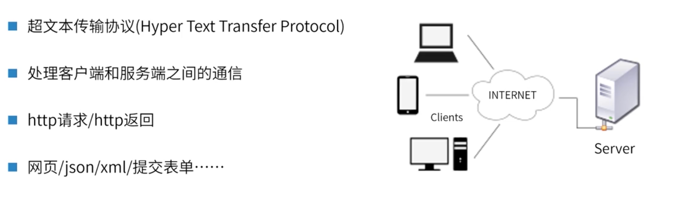
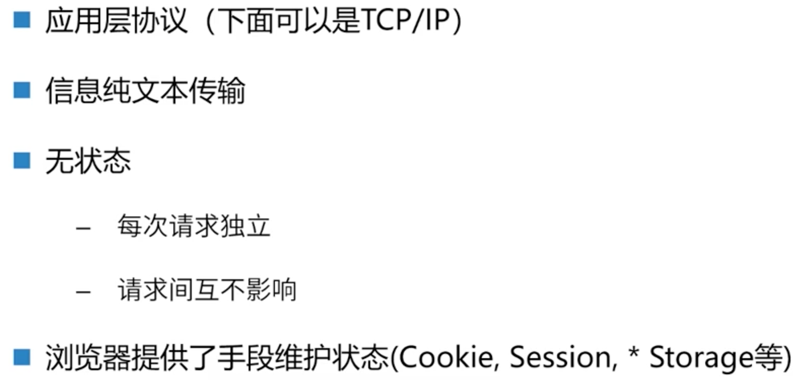
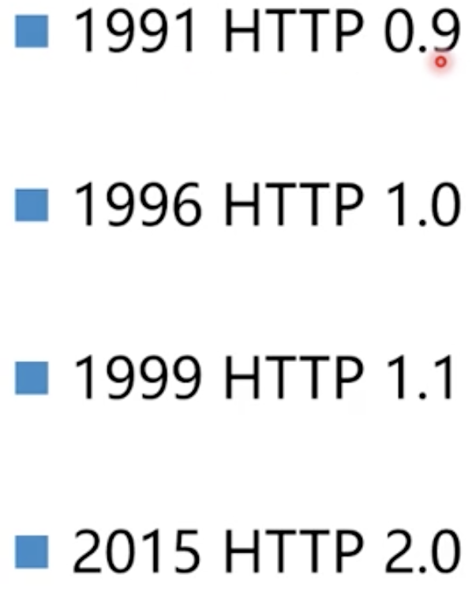
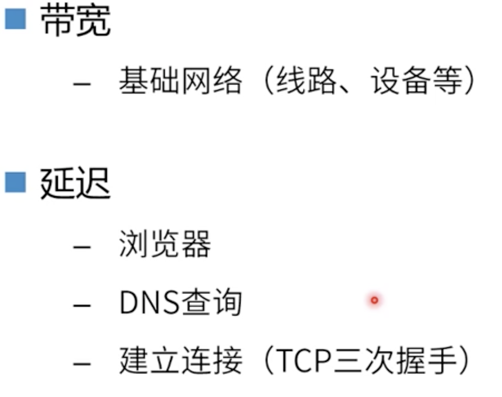
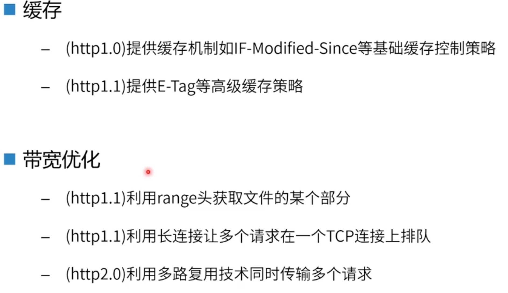
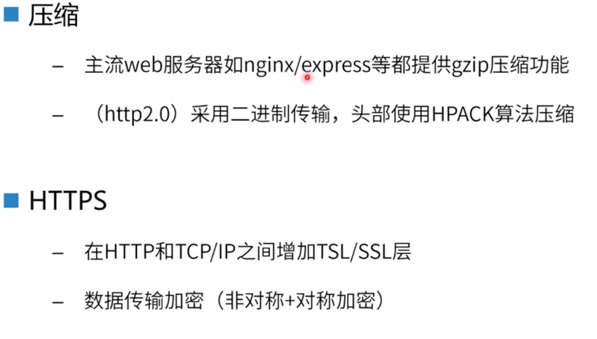
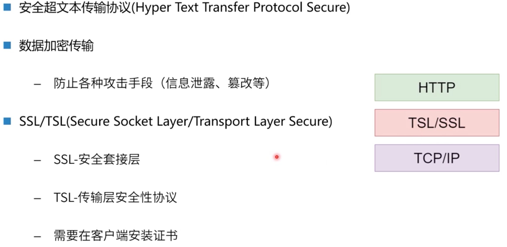
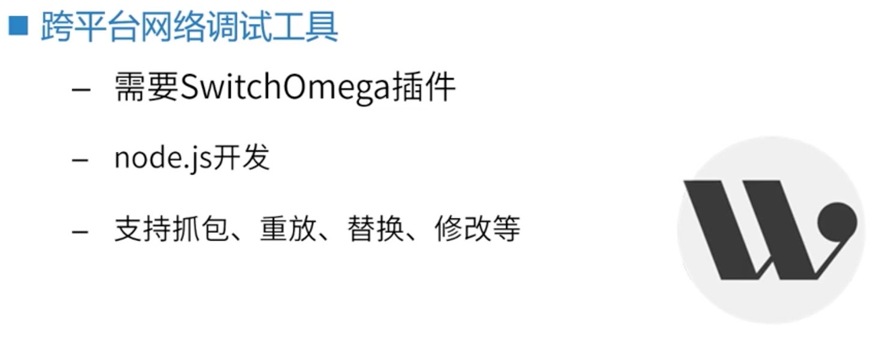

# [HTTP和基础工作链](https://course.study.163.com/480000006851432/lecture-480000037171638)

##### 一、http协议

> http协议是一个文本传输协议，传输内容是人类可读的文本，大体分为两部分:
>
> 请求头和返回头

###### 1.纯文本+无状态

###### 2.HTTP历史

###### 3.设计的基础因素

> 前端最重要的两个因素：
>
> 1.跳出率
>
> 2.用户和交互时间

###### 4.设计考虑因素（性能）--缓存与宽带优化

###### 5.设计考虑因素--压缩/安全性

##### 二、https协议

##### 三、抓包工具

> 安装步骤：
>
> 1.安装Chrome插件SwitchOmega, 可以在Chrome插件商店搜SwitchOmega， 或离线安装， 安装包地址：https://github.com/FelisCatus/SwitchyOmega/releases/download/v2.5.20/SwitchyOmega_Chromium.crx
>
> 2.安装教程：https://chrome.zzzmh.cn/help?token=setup
>
> 3.在终端：npm install whistle -g  （如果遇上权限报错，请加上sudo）
>
> 4.在终端启动：whistle start