# [HTTP详情讲解](https://course.study.163.com/480000006851432/lecture-480000037170784)

##### 一、基本方法

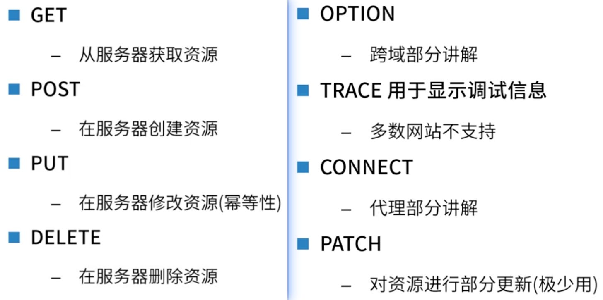

##### 二、状态码

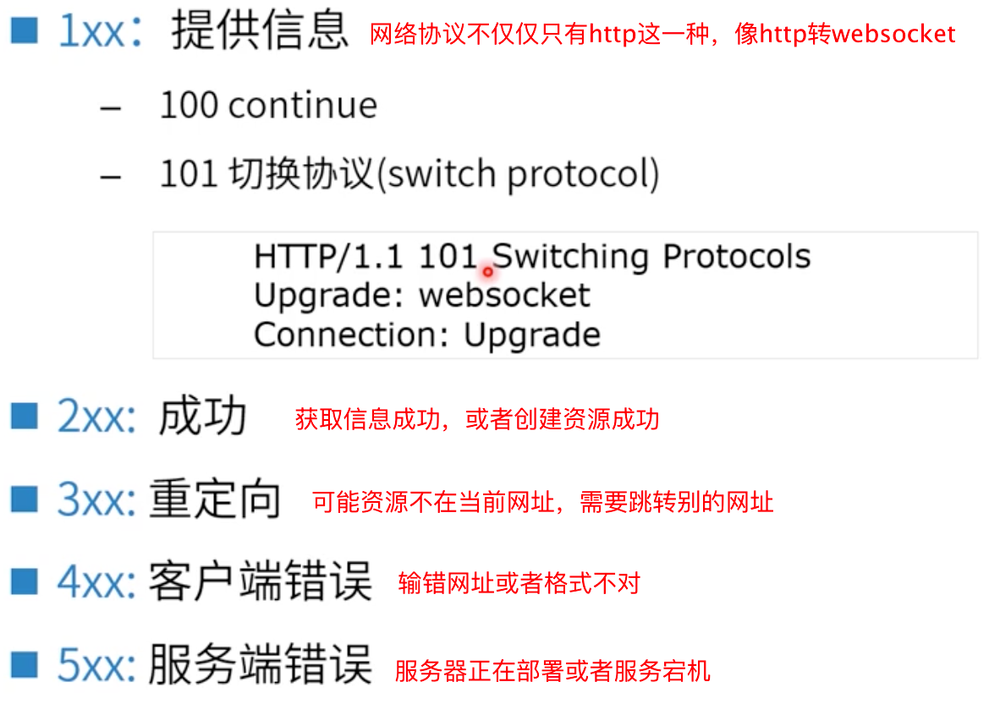

1、2XX状态码

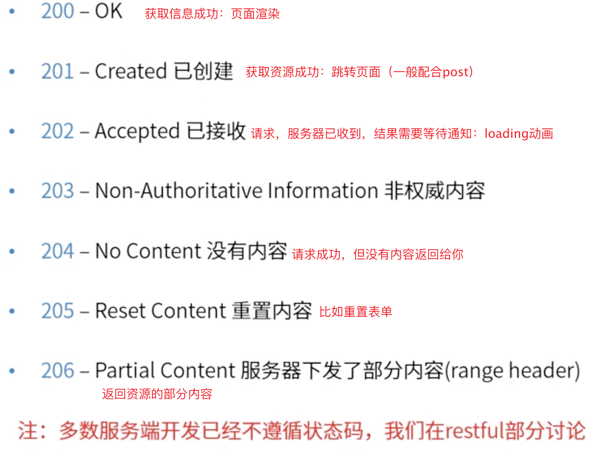

2、3XX状态码(重定向)

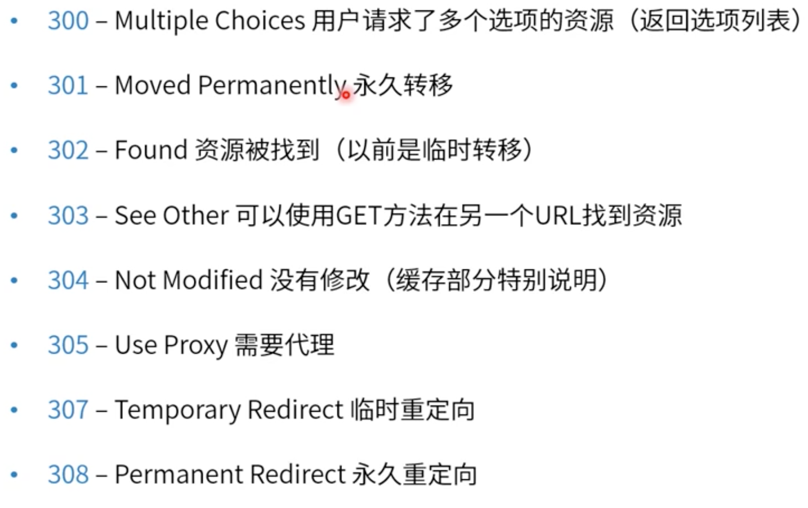

3、4XX状态码

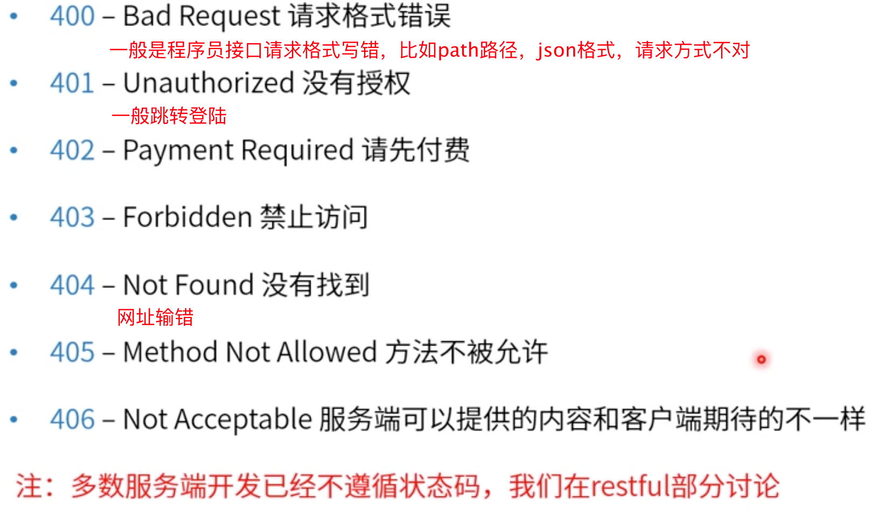

4、5XX状态码

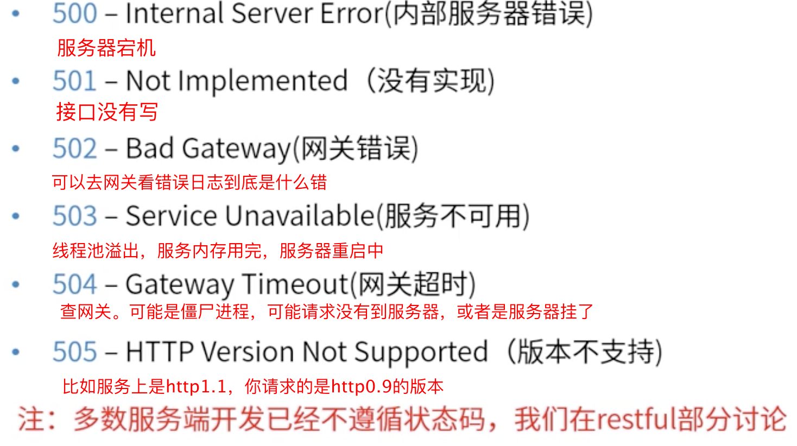

##### 三、Content-length

##### 四、User-Agent

##### 五、Content-Type

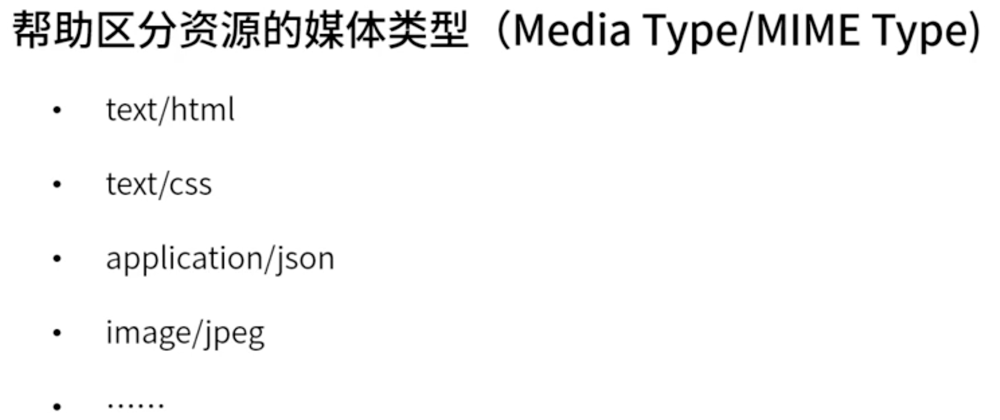

##### 六、Origin(请求头中才有)

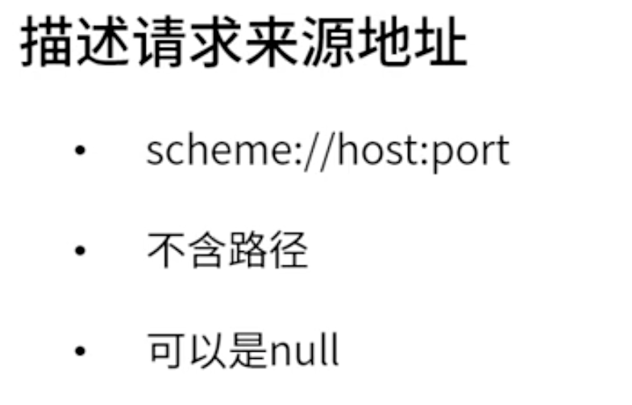

##### 七、Accept

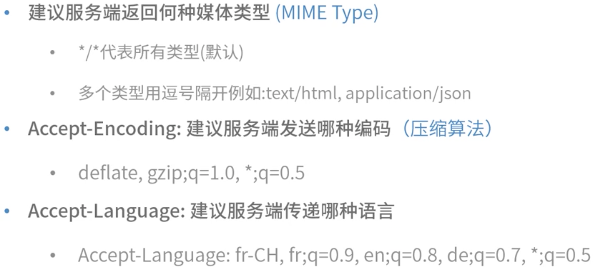

##### 八、Referer(追溯用户行为，从网址的某个地址跳到了哪个地址)

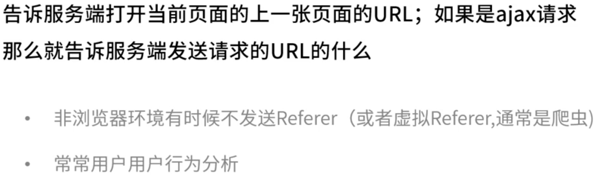

##### 九、Connection(减少握手)

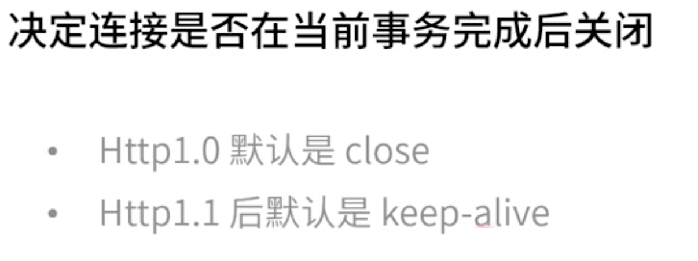