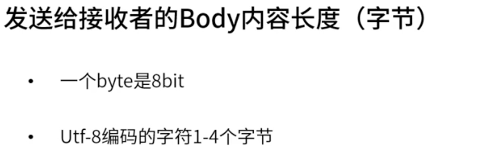
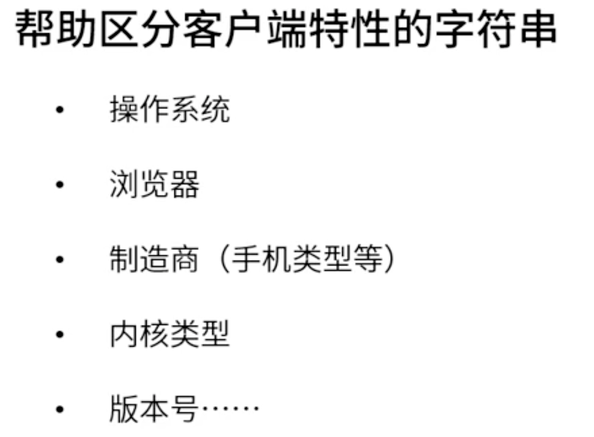

# [HTTP详情讲解](https://course.study.163.com/480000006851432/lecture-480000037170784)

##### 一、基本方法

##### 二、状态码

1、2XX状态码

2、3XX状态码(重定向)

3、4XX状态码

4、5XX状态码

##### 三、Content-length

##### 四、User-Agent

##### 五、Content-Type

##### 六、Origin(请求头中才有)

##### 七、Accept

##### 八、Referer(追溯用户行为，从网址的某个地址跳到了哪个地址)

##### 九、Connection(减少握手)

