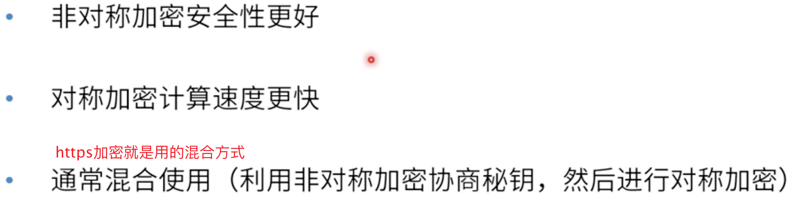

# [加密和HTTPs证书](https://course.study.163.com/480000006851432/lecture-480000037207486)

##### 一、对称加密/非对称加密

###### 	1.非对称加密

##### 	二、解决信任关系

###### 1.证书体系

1.1alibab提供证书

1.2第三方（无利益关系，信誉非常好的公司）通过算法认证alibaba提供的证书，最后得出结论

1.3客户端预装根证书

###### 2.算法如何验证证书

2.1alibab证书找到第三方根证书，通过根证书的私钥算法进行签名形成alibaba的签名

2.2用户通过根证书的公钥能解开alibaba的签名,如果确实是alibaba的话，那么证书有效可信。

ps1：其实，原理大致还是私钥解公钥，公钥解私钥。

ps2：有人说不法分子直接拿到阿里的证书和签名公钥不就可以钓鱼了吗？可是，他始终还是没有阿里的私钥

##### 三、对称vs非对称

##### 四、https工作原理

ps：客户端发送消息到服务端确认收到消息最少花多长时间？160ms

