# [UDPvsTCP,HTTP2.0和3.0](https://course.study.163.com/480000006851432/lecture-480000037323345)

##### 一、UDPvsTCP的区别

> HTTP3.0还没有普及起来，UDP也是在HTTP3.0的阶段

###### 1.UDP比TCP节省网络资源，速度更快

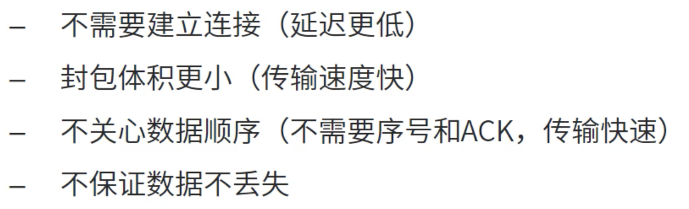

1.1连接

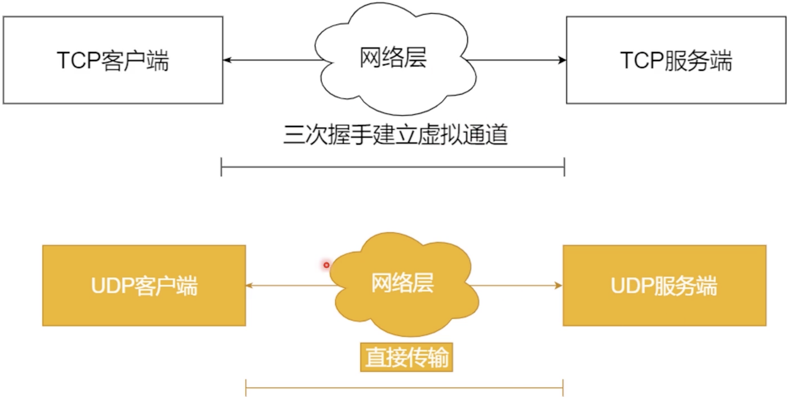

1.2重发（检验）

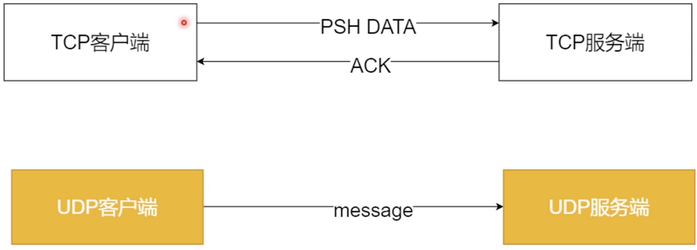

1.3UDP不保证顺序

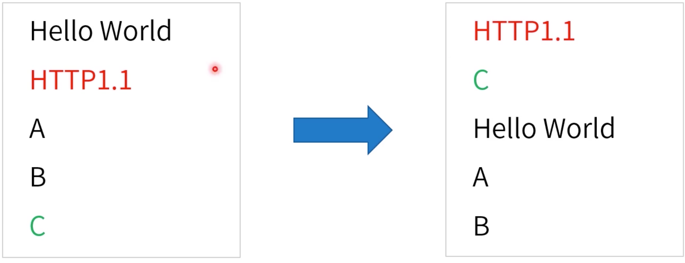

###### 2.思考

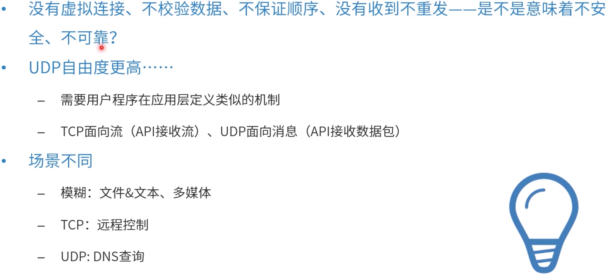

##### 二、HTTP2.0的目标

> 目标：主要是优化流量，优化延迟，解决队头阻塞。对应用层没有改变

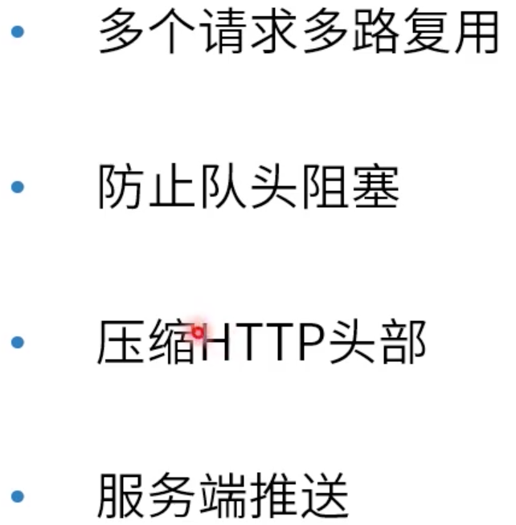

###### 1.HTTP1.1排队问题

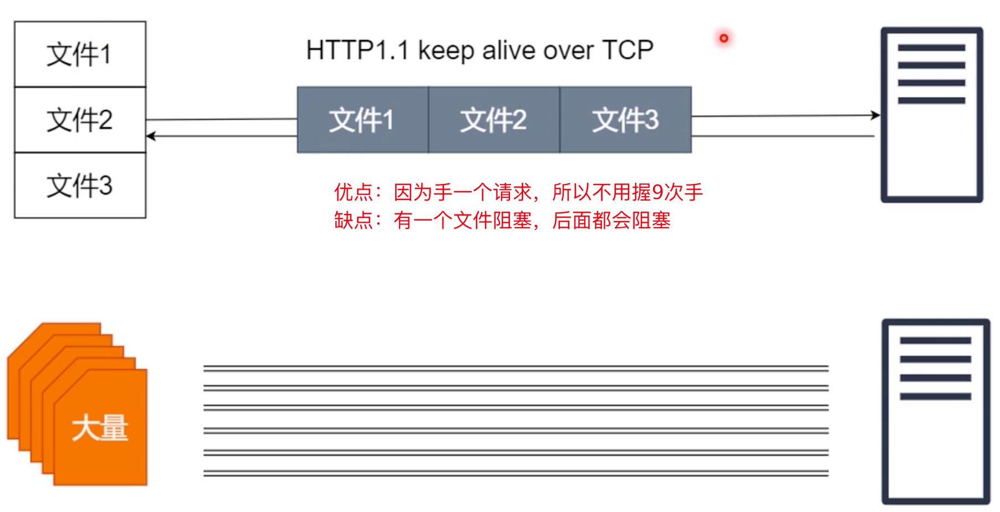

ps：上图优点有中文字错误：因为手一个请求===因为是同一个请求

###### 2.HTTP2.0多路复用

2.1解决队头阻塞

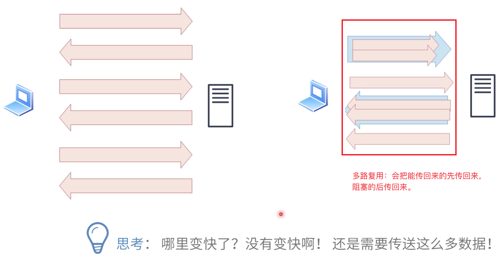

2.2HTTP2.0解决了队头阻塞，但是并没有解决传输封包的一块一块发丢的情况

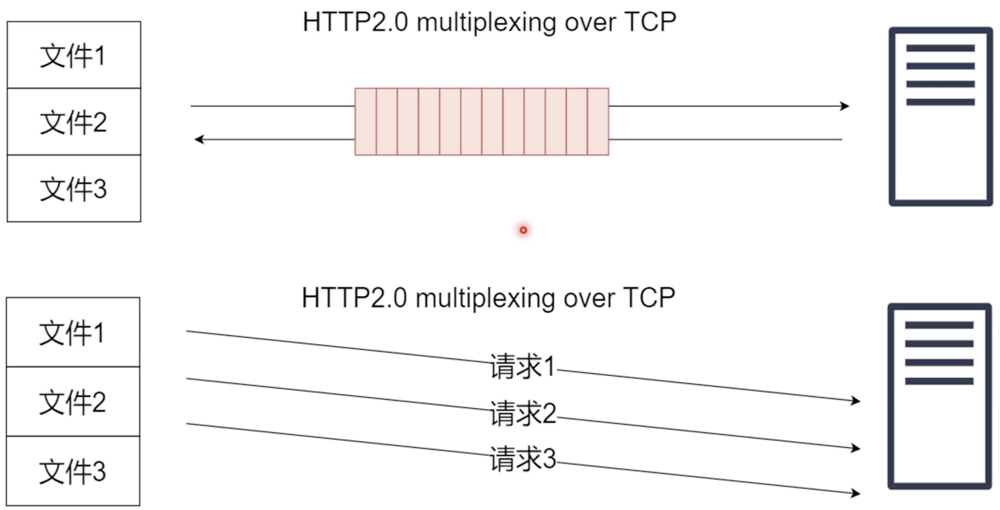

###### 3.HTTP2.0压缩头部

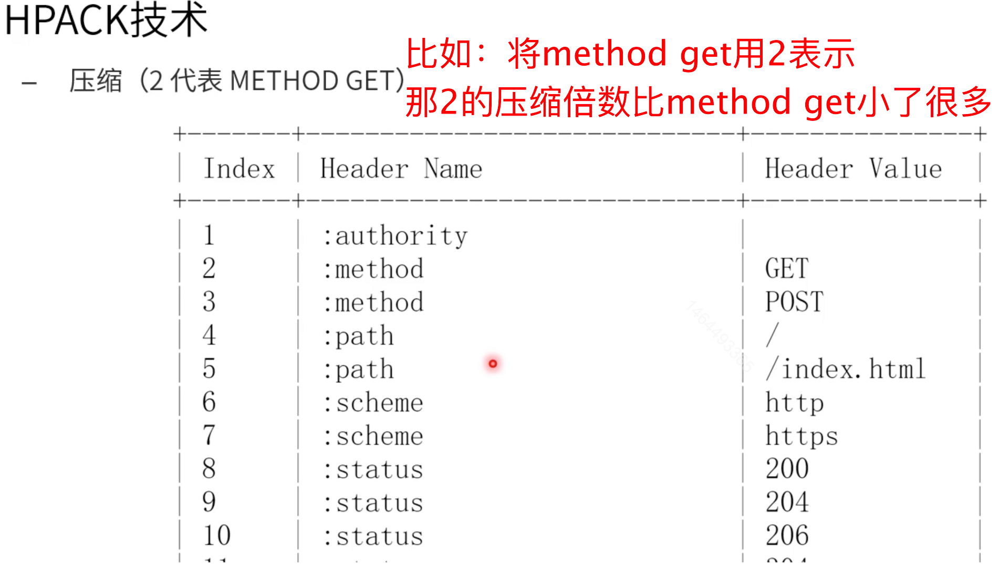

###### 4.HTTP2.0服务端推送

内容暂无

##### 三、HTTP3.0

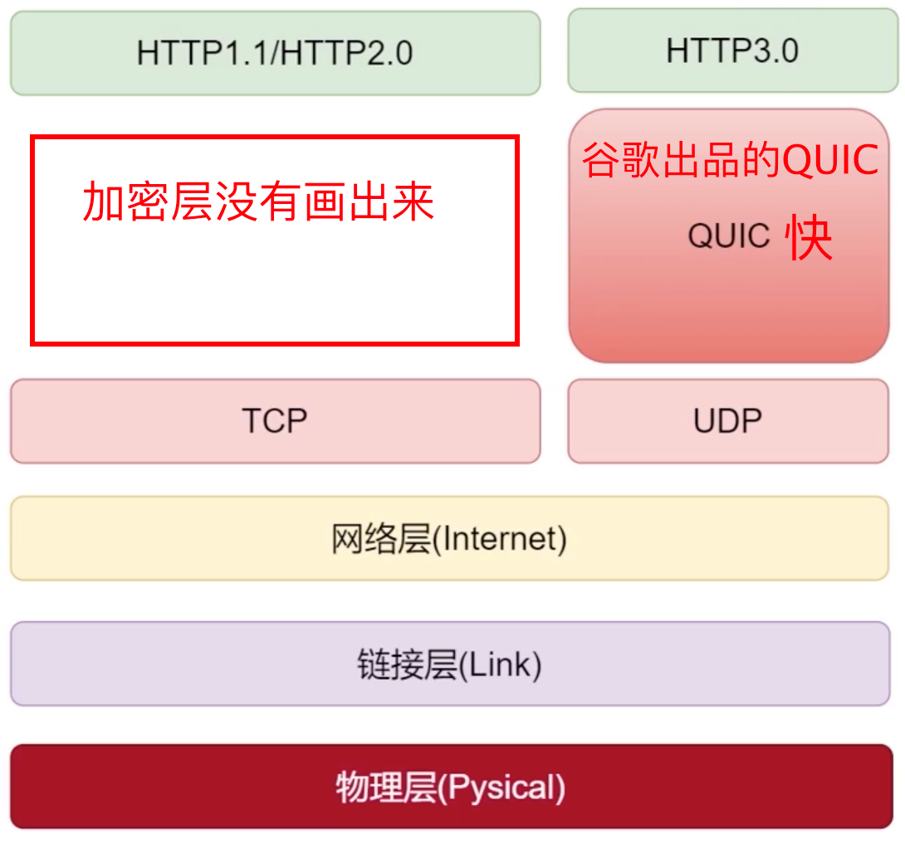

##### 四、总结

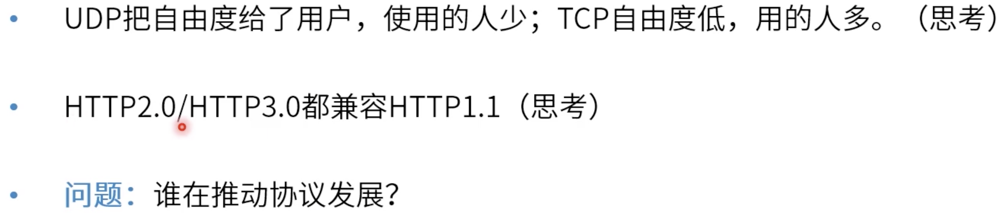