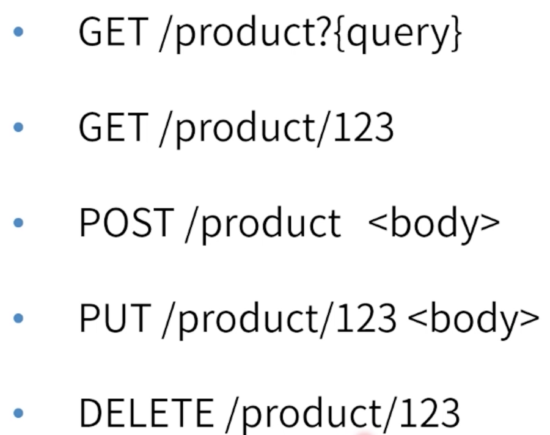

# [restful协议和postman使用](https://course.study.163.com/480000006851432/lecture-480000037170786)

#### 一、restful

> 全名：表现层状态转化（Representational state transfer）
>
> 理解：
>
> 1.client像server发送请求，server响应client给回server state
>
> 2.client通过server state 进行transfer渲染页面
>
> 3.client在restful角度来说不是完全无状态，而是无业务状态
>
> 总结：服务端通过约定给回客户端一个表示，而浏览器通过表示来渲染页面

##### 1.资源、表示和转化

##### 2.约定

##### 3.CURD(约定)

##### 4.restful优点

> 1.状态都放在server管理，client只管展示
>
> 2.服务端在各个领域独立，客户端也更好的去对独立资源做相应的缓存，独立也方便分别管理
>
> 3.对协议依赖不重，可在web端也可以在移动端

