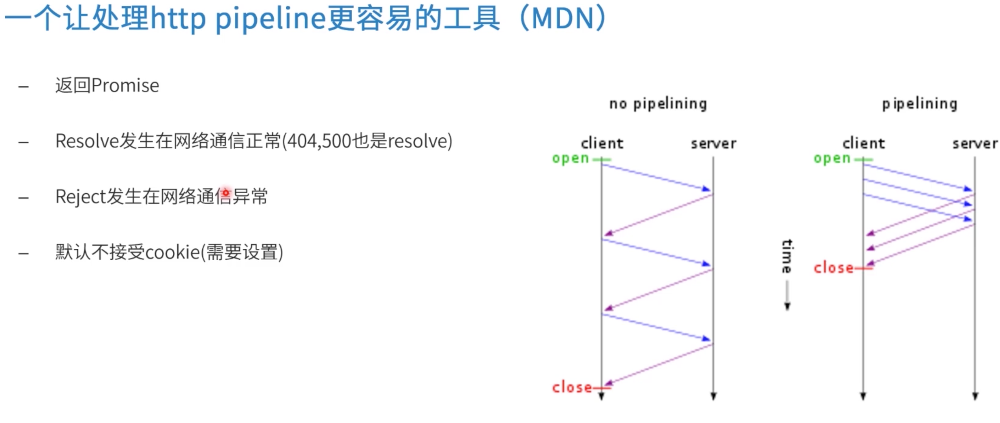

# [Fetch和promise相关的构架](https://course.study.163.com/480000006851432/lecture-480000037170787)

#### 一、promise基本用法

1.图解promise过程：

<div></div>

2.promise-coding示例：

观察 promise在不同阶段的状态和值

```js
				const promise = new Promise((resolve, reject) => {
            reject("some error")
        })
        console.log('promise', promise);

        const promise1 = promise.then(data => {
            console.log("1", data)
        })
        console.log('promise1', promise1);

        const promise2 = promise1.catch(data => {
            console.log("2", data)
            return 1
        })
        console.log('promise2', promise2);

        const promise3 = promise2.then(data => {
            console.log("3", data)
        }
        )
        console.log('promise3', promise3);

        const promise4 = promise3.then(data => {
            console.log("4", data)
        })
        console.log('promise4', promise4);
```

3.promise常见用法

​	3.1resolve和reject 状态指定

​	3.1Chain 链式编程

​	3.3并发和竞争

​	3.4异常处理

```js
// example 01 （resolve 状态指定）
const promise = new Promise((resolve, reject) => {
  resolve(100)
}).then(data => {
  console.log(data)
})

// example 02 （Chain 链式编程）
const promise = new Promise((resolve, reject) => {
  resolve(100)
}).then(data => {
  console.log(data)
  return 'abc'
})
.then(data => {
  console.log(data)
})

// example 03 （）
function wait(ms = 1000, data) {
  return new Promise((resolve) => {
    setTimeout(() => {
      resolve(data)
    }, ms)
  })
}
const promise = new Promise((resolve, reject) => {
  resolve(100)
}).then(data => {
  console.log(data)
  return wait(1000, 'abc')
})
.then(data => {
  console.log(data)
  console.log('here--')
})

// example 04

const promise = new Promise((resolve, reject) => {
  reject("some error")
}).then(data => {
  console.log("1", data)
}).catch(ex => {
  console.error(ex)
  return "GO"
}).then(data => {
  console.log(data)
})


// example 05 （异常处理）

function wait(ms = 1000, data){
  return new Promise((resolve, reject) => {
    setTimeout(() => {
      resolve(data)
    }, ms)
  })

}

async function foo(){
  console.log('--begin--')
  const one = await wait(1000, 1)
  console.log('--tick 1--')
  const two = await wait(1000, 2)
  console.log('--tick 2--')
  console.log(one, two)

  await Promise.reject('some error')
  try{
    await Promise.reject('some error')
  } catch(ex) {
    console.log(ex)
  }
}
foo()


// example 06（Promise.all和Promise.race）并发和竞争
function wait(ms = 1000, data){
  return new Promise((resolve, reject) => {
    setTimeout(() => {
      resolve(data)
    }, ms)
  })

}
Promise.all([wait(200, 1), wait(100, 2)])
  .then(data => {
    console.log('all', data)
  })

Promise.race([wait(200, 1), wait(100, 2)])
  .then(data => {
    console.log('race', data)
  })
```

4.手写promise中resolve，reject和then

```js
const PENDING = 1
const FULLFILLED = 2
const REJECTED = 3


class Promise{
  //构造函数executor被传入
  constructor(executor){
    //promose创建的第一时间是PENDING状态的
    this.state = PENDING
    //这里注意，不是什么情况下都可以resolve，可以resolve的时候状态应该是PENDING
    const resolver = (value) => {
      if(this.state === PENDING) {
        this.state = FULLFILLED 
        this.value = value 
      }
			//把PENDING里所有状态的都resolve
      for(let [onFullFill, resolve] of this.fullfills) {
        const x = onFullFill(this.value)
        resolve(x)
      }
    }
    const rejector = () => {
      this.state = REJECTED
    }

    this.fullfills = []
    //executor 创建第一时间被执行
    executor(resolver, rejector)
  }
  //可写，可不写
  // executor = () => {};
  
  //需要传入一个onFullfill方法
  then(onFullfill) {
    //then的时候要返回一个新的promise对象
    return new Promise((resolve, rejector) => {
      //这里then要判断现在promise状态
      switch(this.state) {
        case FULLFILLED:
          //如果是现在是FULLFILLED状态，那么直接拿到这个值，并且把这个PromiseResult结果通过reslve指定状态后传递出去
          const x = onFullfill(this.value)
          resolve(x)
          break
        case PENDING:
          this.fullfills.push([onFullfill, resolve])
          break
      }
    })
  }
}

new Promise((resolve) => {
  setTimeout(() => {
    resolve('123')
  })
}).then(data => {
  console.log(data)
  return '456' 
}).then(data => {
  console.log(data)
  return data
})
```


#### 二、fetch

在`window`中本来就有`fetch`这个函数，而在`node`中需要引入`fetch`这个库

<div></div>

1.Fetch返回的是一个promise对象（Response对象）

<div></div>

#### 三、实战（指数补偿）

> 模拟网络环境延迟

```js
const fetch = require('node-fetch')
//模拟发送请求
function request(url){
  //代表请求确定回来了
  let resolved = false
  //指数
  let t = 1 
  //走接口对接
  return new Promise((resolve) => {
    //闭包函数 会拿到传进来的url
    function doFetch(){
      //判断 如果是resolved请求回来了，就不做下面逻辑
      if(resolved || t > 16) {
        return
      }
      //如果请求没回来，fetch发送请求，返回的是promise对象（Response对象）
      //如果网络异常，fetch会将promise状态置为reject，下面的.then不会执行
      fetch(url).then((resp) => {
        //先拿到网站的文本
        return resp.text()
      })
      //再拿到最终网站请求的数据
      .then(data => {
        //如果请求没有回来，就是如下的逻辑。
        if(!resolved) {
          //请求回来的状态设置为true
          resolved = true
          //primise状态设置为成功，并把返回的最终参数data return出去
          resolve(data)
          console.log('t=', t)
        }
      })
      .catch(ex => {
        //.catch错误捕获，程序继续执行
        console.error(ex)
      })
      //利用倒计时递归调用doFetch方法
      setTimeout(() => {
        doFetch()
        t *= 2
      }, t * 100)
    }
    doFetch()
  })
}

request('http://www.baidu.com')
  .then(data => {
    console.log(data.length)
  })
```

#### 四、实战（并发处理和时间窗口）

> - 多个资源并发请求，比如多个组件同时请求一个资源地址
>
>   Promise.all
>
> - 基于时间窗口过滤重复请求

```js
const fetch = require('node-fetch')

function hash(args) {
  return args.join(',')
}
function window(f, time = 50) {
  let window = {} 
  let flag = false 
  return (...args) => {
    return new Promise((resolve) => {
      if (!window[hash(args)]) {
        window[hash(args)] = {
          func: f,
          args,
          resolvers: [],
        }
      }
      if (!flag) {
        flag = true
        setTimeout(() => {
          Object.keys(window).forEach((key) => {
            const { func, args, resolvers } = window[key]
            const promise = func(...args)
              .then((resp) => resp.text())
              .then((text) =>
                resolvers.map((r) => {
                  r(text)
                })
              )
          })
          flag = false
        }, time)
      }
      console.log(args)
      window[hash(args)].resolvers.push(resolve)
    })
  }
}

const request = window(fetch, 20)

request('http://www.baidu.com')
  .then(txt => console.log(txt.length))
request('http://www.baidu.com')
  .then(txt => console.log(txt.length))
request('http://www.baidu.com')
  .then(txt => console.log(txt.length))

request('http://www.zhihu.com')
  .then(txt => console.log(txt.length))
request('http://www.baidu.com')
  .then(txt => console.log(txt.length))
request('http://www.baidu.com')
  .then(txt => console.log(txt.length))
```

