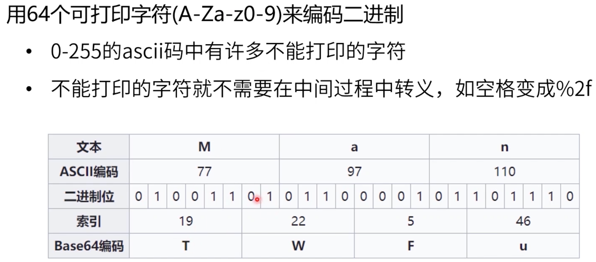

# [实战文件上传](https://course.study.163.com/480000006851432/lecture-480000037172593)

#### 一、表单提交方式


> 接下来的例子中，都需要如下的js文件

```js
const express = require('express')
const fs = require('fs')
const path = require('path')
const bodyParser = require('body-parser')
// 文件上传工具中间件 （工厂方法用来产生实例）
const fileUpload = require('express-fileupload')
const { urlencoded } = require('express')
const app = express()

app.get('/submit', (req, res) => {
  res.sendFile(path.resolve(__dirname, "submit.html"))
})

app.get('/base64', (req, res) => {
  res.sendFile(path.resolve(__dirname, "submitb64.html"))
})
app.get('/binary', (req, res) => {
  res.sendFile(path.resolve(__dirname, "submitbinary.html"))
})

app.post(
  "/submitbinary",
  fileUpload(),
  (req, res) => {
    console.log(req.files, req.body)
    req.files.file.mv(path.resolve(__dirname, 'upload/b.jpg'))
    res.send("ok")
  }
)

app.post(
  "/submit",
  fileUpload(),
  (req, res) => {
    console.log(req.files, req.body)
    req.files.file.mv(path.resolve(__dirname, 'upload/a.jpg'))
    res.send("ok")
  }
)
app.post(
  "/submitb64",
  bodyParser.json(),
  (req, res) => {
    //这里注意：使用base64 比较占用空间
    const buffer = new Buffer(req.body.data, 'base64')
    console.log(req.body.data.length)
    fs.writeFileSync(
      path.resolve(__dirname, "upload/x.jpg"), 
      buffer)
    res.send("ok")
  }
)

app.listen(3000)
```


```html
<!DOCTYPE html>
<html>
<body>

<h2>HTML Forms</h2>
<!-- 
action 提交地址（url）
method 提交方式
enctype 编码方式
1.enctype="application/x-www-form-urlencoded" 这种传输方式只有文件名字，没有文件内容
2.enctype="multipart/form-data" 这种传输方式有文件名字和内容，采用分割段 形式
-->
<form action="/submit" method="POST" enctype="multipart/form-data">
  <label for="fname">First name:</label><br>
  <input type="text" id="fname" name="fname" value="张"><br>
  <label for="lname">Last name:</label><br>
  <input type="text" id="lname" name="lname" value="三"><br><br>
  <label for="file">file:</label><br>
  <input type="file" id="file" name="file"><br><br>

  <input type="submit" value="Submit">
</form> 

</body>
</html>

```


#### 二、html5方式

1.base64




```html
<!DOCTYPE html>
<html>

<body>

  <h2>HTML Forms</h2>

  <div>
    <label for="file">file:</label><br>
    <input type="file" id="file" name="file"><br><br>
    <input onClick='submit()' type="submit" value="Submit">
  </div>

  <script>
    let upload = {}
    function submit() {
      console.log('here', upload)
      fetch('/submitb64', {
        method: "POST",
        //因为base64中也有=号，下面的name=不怎么可取，所以我们直接用json的方式
        //body : `name=${upload.name}&data=${upload.data}`,
        body: JSON.stringify(upload),
        headers: {
          // 'Content-Type': 'application/x-www-form-urlencoded'
          //'application/json' 与上面的body保持一致
          'Content-Type': 'application/json'
        }
      })
    }
    document.getElementById("file").addEventListener('change', e => {
      const files = e.target.files
      for (let file of files) {
        //FileReader() 读取File（Blob）文件，因为DOM里面File的父类就是Blob。
        //而且，Blob与buffer有本质区别，buffer是二进制缓冲区。
        const fr = new FileReader()
        fr.readAsDataURL(file)
        fr.onload = () => {
          console.log(fr.result)
          upload.data = fr.result.substr(22)
          upload.name = file.name
        }
      }
    })
  </script>
</body>

</html>
```


2.boundary

> Base64编码 是把4个字母用来描述3个可见字符，也就是说1M的文件会变成4/3（1.333M）。
>
> 通过base64编码后就更大

```html
<!DOCTYPE html>
<html>
<body>

<h2>HTML Forms</h2>

<div>
  <label for="file">file:</label><br>
  <input type="file" id="file" name="file"><br><br>
  <input onClick='submit()' type="submit" value="Submit">
</div> 

<script>
  let upload = {}
  function submit(){
    console.log('here', upload)
    const formData = new FormData()
    formData.append('name', upload.name)
    formData.append('file', upload.data)
    fetch('/submitbinary', {
      method : "POST",
      body : formData,
      headers : {
        // 这里如果设置了Content-Type会有Bug
        // 'Content-Type' : 'multipart/form-data'
      }
    })
  }
  document.getElementById("file").addEventListener('change', e=>{
    const files = e.target.files
    for(let file of files) {
        upload.data = file 
        upload.name = file.name
    }
  })
</script>
</body>

</html>

```

#### 三、总结


上传文件和提交表单没有本质区别，都是提的body和http协议。

传的二进制还是文本其实也没有本质区别，可以相互转换。