# [HTTP缓存和缓存清理](https://course.study.163.com/480000006851432/lecture-480000037171640)

#### 一、缓存

<div>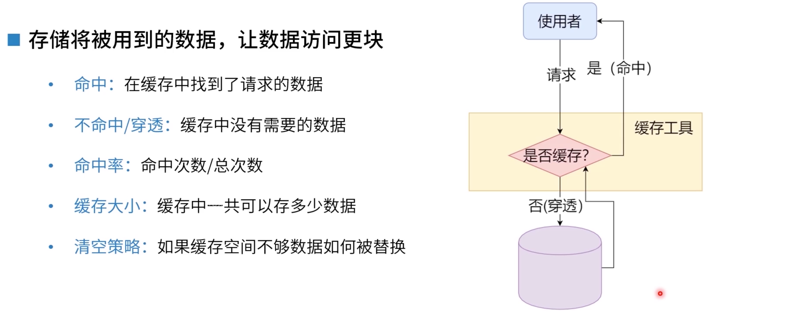</div>

#### 二、清空策略

1.先进先出策略（fifo算法）

<div>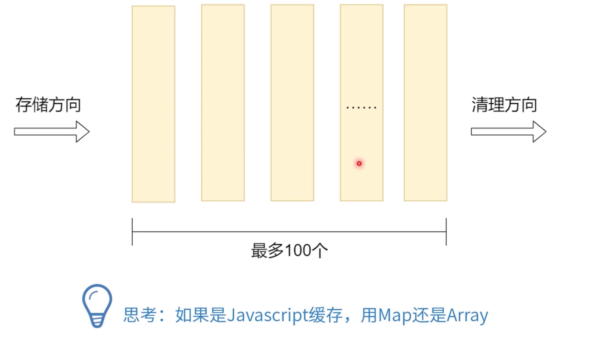</div>

```js
function memory(f, maxSize = 10) {
  // [{hash, value}]
  const cache = [];

  return (...args) => {
    const hash = args.join(",");

    const item = cache.find((x) => x.hash === hash);
    if (item) {
      return item.value;
    }

    const result = f(...args);
    cache.push({
      hash,
      value: result,
    });

    if (cache.length > maxSize) {
      cache.shift();
    }
    return result;
  };
}

// 1 1 2 3 5 8 13
function fib(n) {
  if (n === 1 || n === 2) {
    return 1;
  }
  return mfib(n - 1) + mfib(n - 2);
}
const mfib = memory(fib, 10);
console.log(fib(100));

```

2.使用频率最低策略

<div>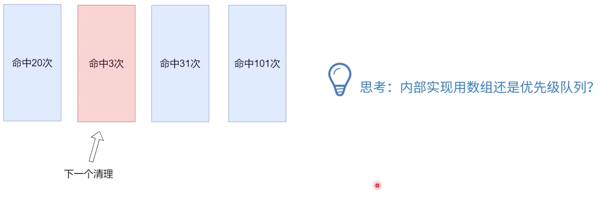</div>

3.时间最久远策略

ps:假如最久远的刚好被使用过了，那它就成为最近的时间

<div>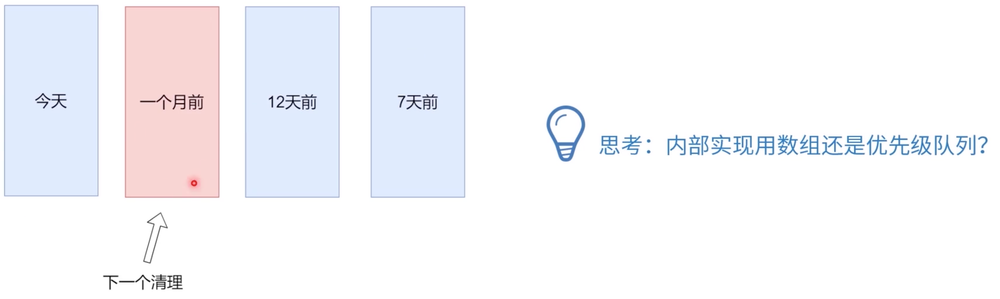</div>

```js
function memory(f, maxSize = 10) {

  // [{hash, value}]
  let cache = []
  //let cache = {}

  return (...args) => {
    const hash = args.join(',')

    const item = cache.find(x => x.hash === hash)
    if(item) {
      item.time = new Date().getTime()
      return item.value
    }

    const result = f(...args)
    cache.push({
      hash,
      value: result,
      time: new Date().getTime()
    })

    if(cache.length > maxSize) {
      let min = Infinity
      let minItem = null
      for(let item of cache) {
        if(item.time <min) {
          min = item.time
          minItem = item
        }
      }
      cache = cache.filter(x => x !== minItem)
    }
    return result
  }

}

// 1 1 2 3 5 8 13
function fib(n) {
  if(n === 1 || n === 2) {
    return 1
  }
  return mfib(n-1) + mfib(n-2)
}
const mfib = memory(fib, 10)
console.log(fib(40))
```


#### 三、http缓存

> http缓存是通过两边协议在协商
>
> 1.cache-contorl :定义了所有缓存都要遵守的行为，如：可缓存性、缓存期限，大致就是说：客户端要不要缓存，中间代理要不要缓存，服务端要不要缓存等等...
>
> 2.max-age :一般都在客户端
>
> 3.no-cache 和max-age=0 是一个意思（协商缓存）
>
> <div>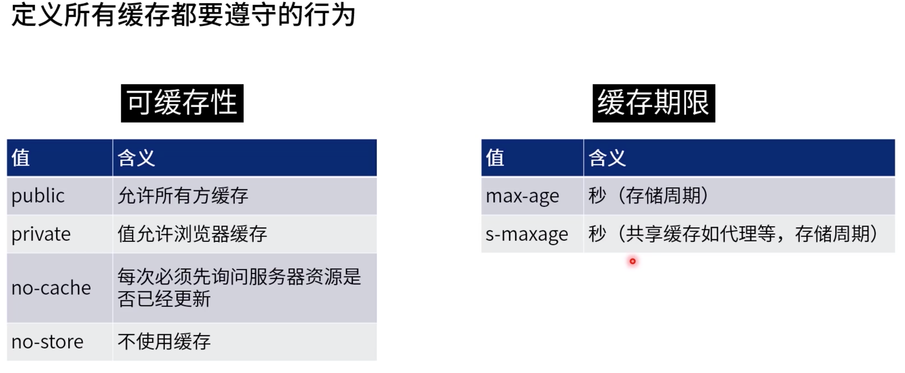</div>
>
> 3.cache-control常见用法
>
> <div>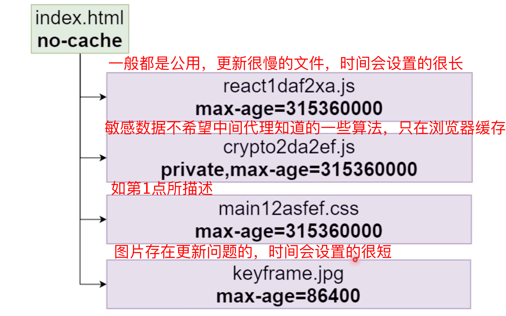</div>


#### 四、强制缓存

> 1.强制缓存的标志性：就是不再往服务端发请求
>
> 2.强制缓存优先级很高
>
> 3.强制缓存后，文件有更新客服端也不会更新，要等缓存完之后才会更新（有清理不掉缓存的顾虑）
>
> 4.应用场景：强制缓存一些很长时间都不会变化更新的文件，如jquery1.9.2.min.js
>
> <div>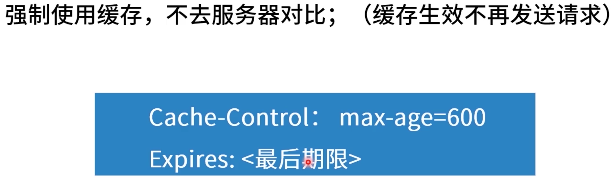</div>
>
> <div>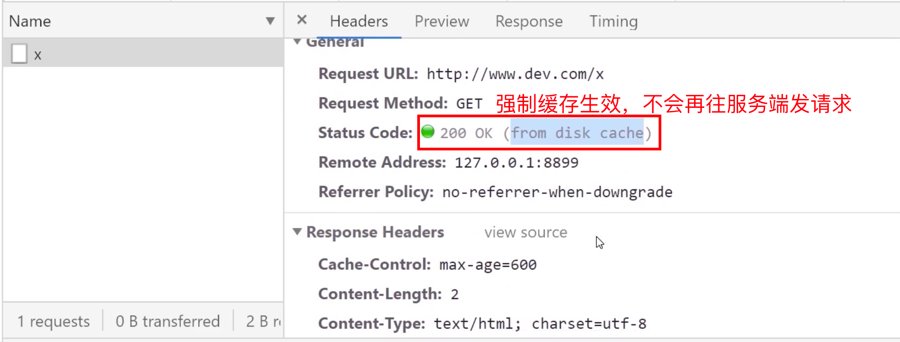</div>

#### 五、协商缓存（可以不用计算时间）

> 1.比如请求页面，请求接口
>
> 2.协商缓存比较好，不用担心缓存清理不掉

<div>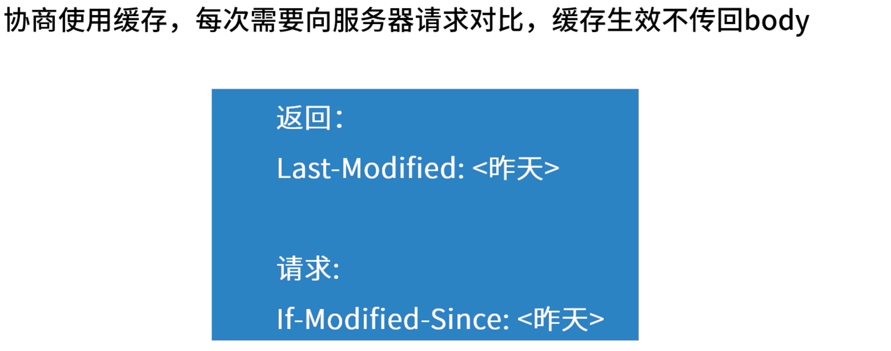</div>

<div>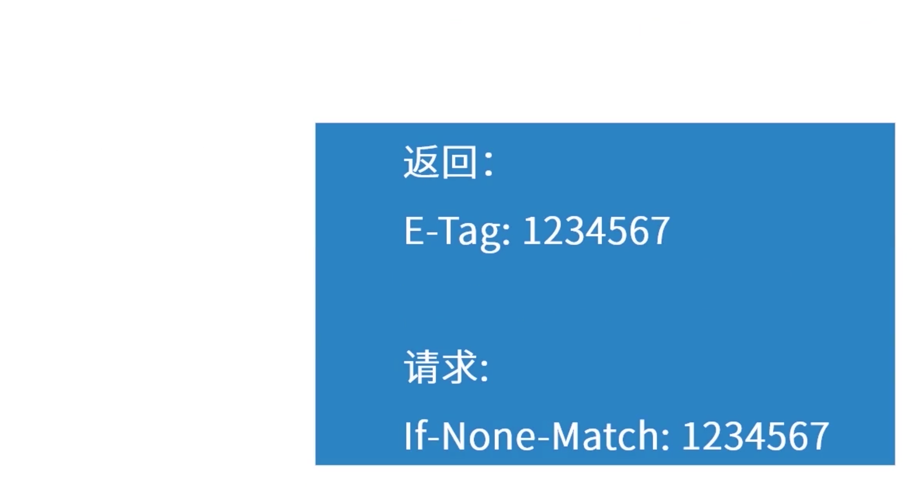</div>

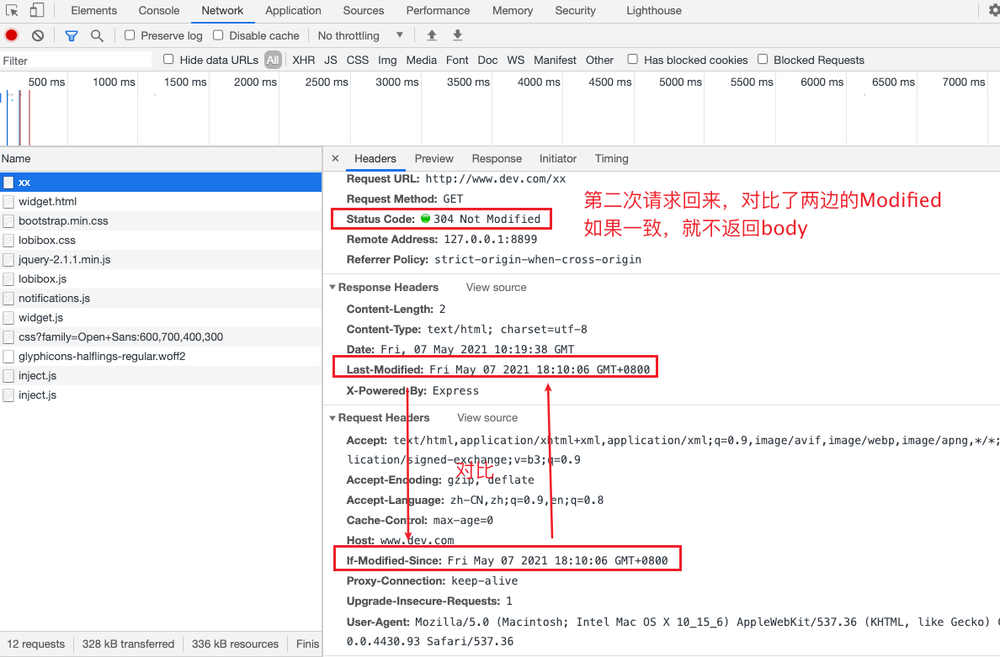

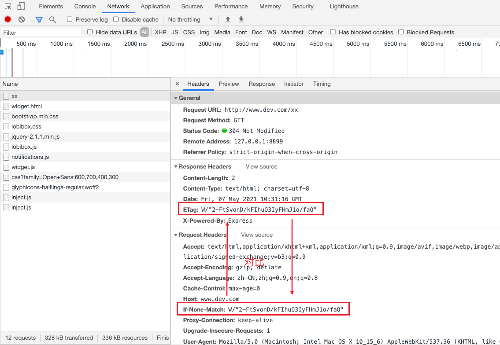

#### 六、总结

<div>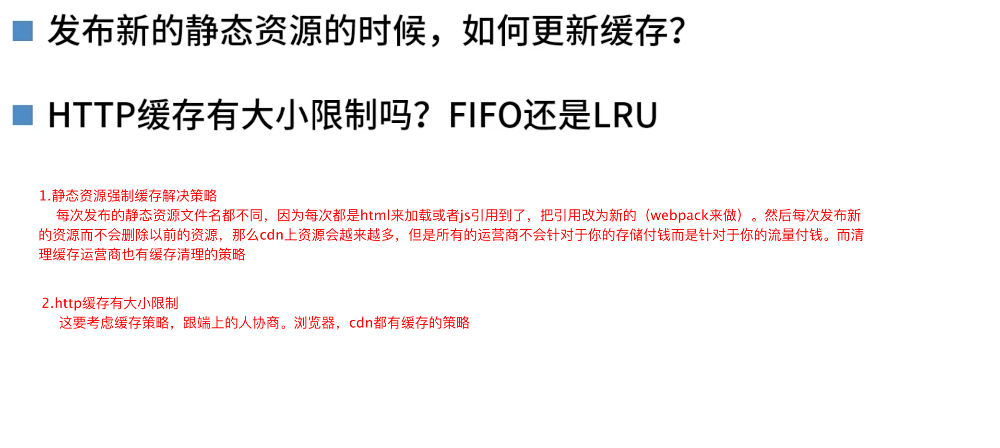</div>