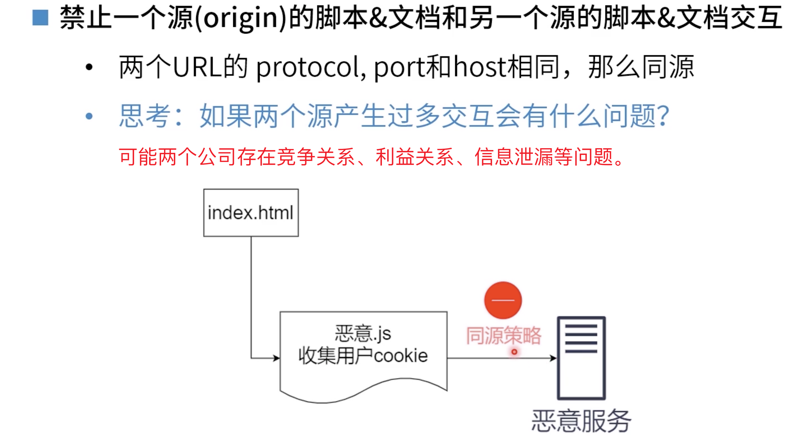
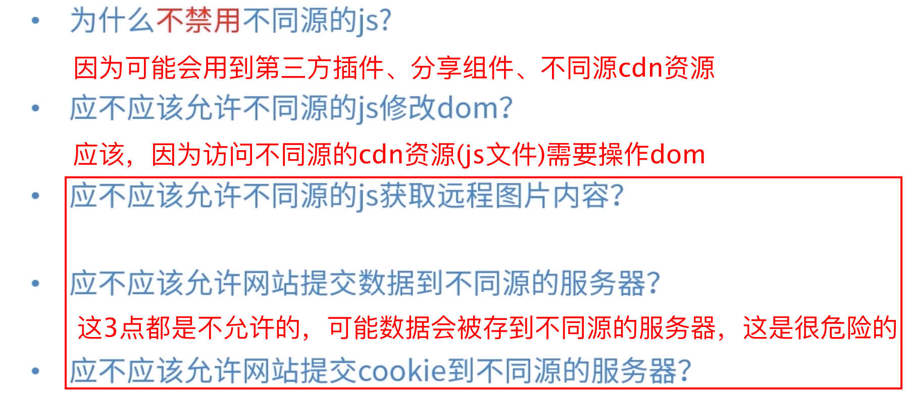
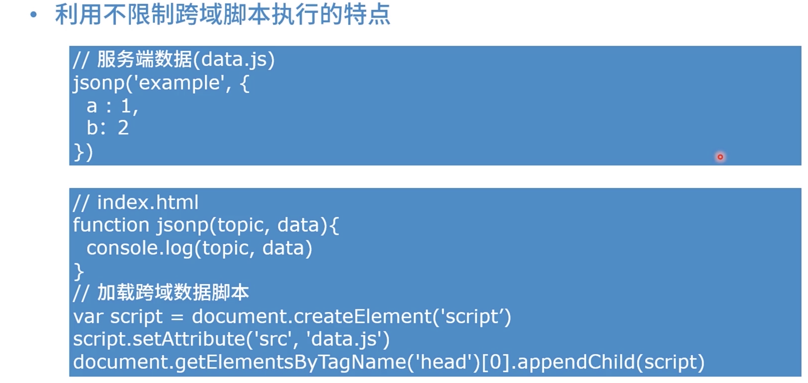
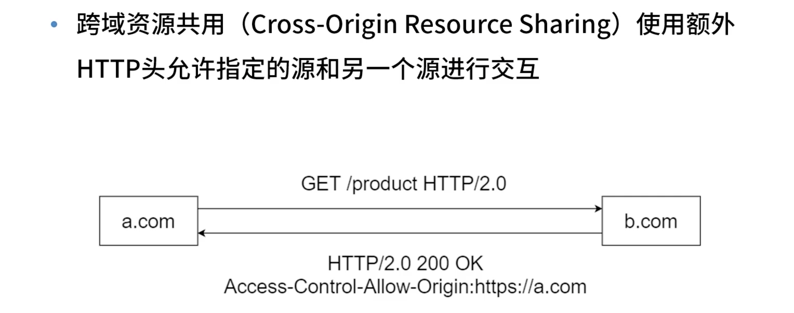
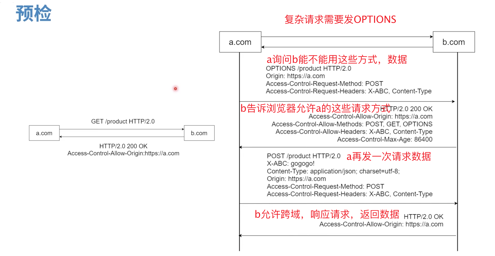
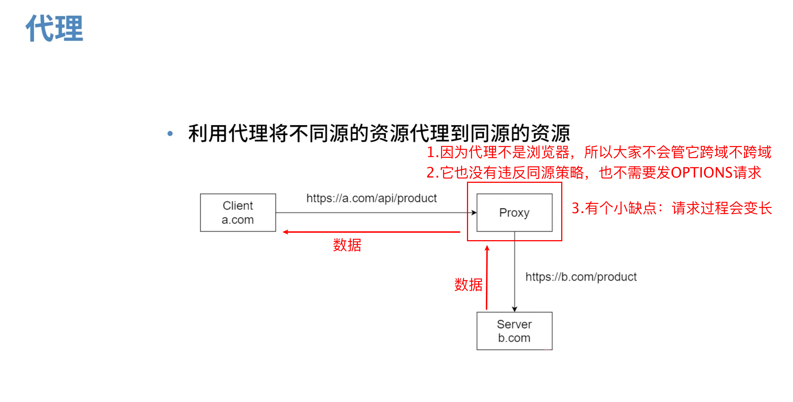

# [同源策略](https://course.study.163.com/480000006851432/lecture-480000037172595)

#### 一、定义

#### 二、思考

#### 三、跨域的N种方法

> 同源策略是浏览器在控制
>
> 

> Cross  将请求分为简单请求和复杂请求两种，浏览器会预检判断你是简单请求还是复杂请求，如果是简单请求就直接发get或者post，如果是复杂请求就需要发OPTIONS，但是OPTIONS请求有个缺点是消耗带宽和延迟
>
> 

>
> 

> 

