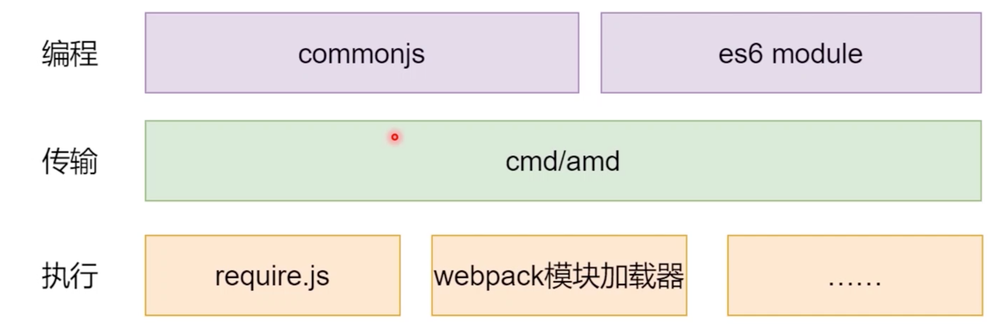
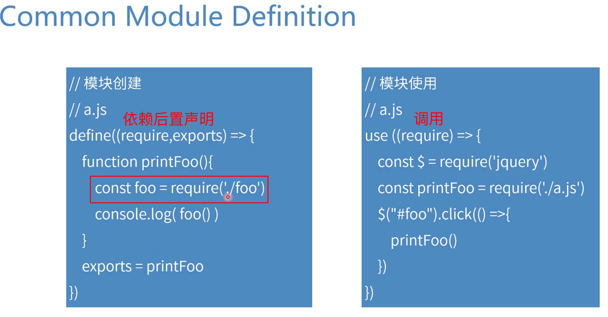
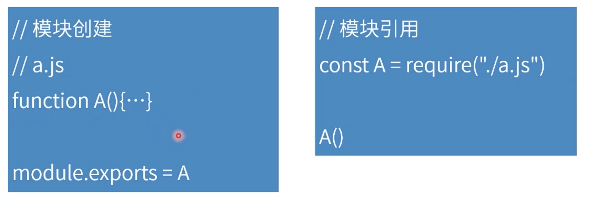
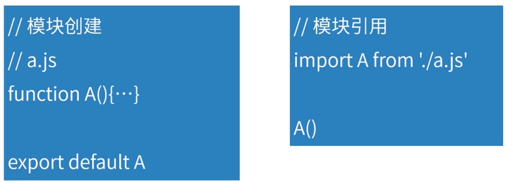

# [异步模块加载/方式](https://course.study.163.com/480000006851432/lecture-480000037170789)

#### 一、整体结构

> 编程：程序就写在编程上
>
> 


#### 二、AMD规范（底层建设）

> 


#### 三、CMD规范（底层建设）

> 


#### 四、CommonJS规范（书写规范）

> 1.CommonJS规范源于nodeJS
>
> 2.CommonJS还是需要转译成浏览器能解析的，比如转译方式是CMD
>
> ps：这里我之前试过把require放入浏览器解析会报错，因为浏览器里没有require和module 
>
> 


#### 五、ES6 Module规范（书写规范）

> 1.与CommonJS没有多大的区别，但语法上还是有区别
>
> 2.import关键字不再是函数，设计者逐渐让它们规范了起来
>
> 


#### 六、加载器示例

> 有空补上代码详细解析说明
>
> ```js
> const express = require('express')
> const app = express() 
> const path = require('path')
> 
> app.use(express.static(path.resolve(__dirname, 'lib')))
> 
> app.get('/', (req, res) => {
>   res.send(`
>   <html>
>     <body>
>     <script src='/require.js' ></script>
>     <script>
>       require.path = '/'
>       require(['add', 'mult'], (add, mult) => {
>         console.log(add(3, 5))
>         console.log(mult(3, 5))
>       })
>     </script>
>     </body>
>   </html>
>   `)
> })
> 
> app.listen(3000)
> ```
>
> ```js
> let modules = {}
> function define(name, func){
>   modules[name] = func 
> }
> 
> function lookup(name){
>   return require.path + name + ".js"
> }
> 
> function require(deps, callback){
> 
>   function loadModule(name) {
> 
>     return new Promise((resolve) => {
>       const script = document.createElement('script')
>       script.src = lookup(name)
> 
>       script.addEventListener('load', () => {
>         resolve(modules[name])
>       })
>       document.body.appendChild(script)
>     })
> 
>   }
> 
>   const promises = deps.map(loadModule)
>   Promise.all(promises).then(modules => {
>     callback(...modules)
>   })
> }
> ```


#### 七、总结

1.异步模块整体结构有编程模型，传输模型，落到浏览器执行的模型，我们写的时候还是写的编程模型里的CommonJS和ES6 Module

2.CMD、AMD是现在的底层建设，大家平时会用它们来进行模块加载，因为浏览器不兼容CommonJS和ES6 Module

3.无论CMD、AMD里的define、use函数都需要有工具去提供，从执行层面来讲有各种各样的工具去实现这些规范